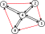

# Halfedges

For each successful triangulation (with any settings) except triangles and positions, one can get [`Output.Halfedges`][halfedges].
Halfedges are a data structure that describes neighboring triangles.
All triangles in the generated mesh are clockwise.
For example, consider triangle $(a, b, c)$ (at indexes: $i, i+1, i+2$ in [`Output.Triangles`][triangles]), which is made of 3 halfedges $(a, b)$, $(b, c)$, $(c, a)$.
A halfedge is a directed edge, i.e., $(i, j) \neq (j, i)$.
In the halfedges buffer, one can find the $\mathtt{id}$ of the opposite halfedge, if it exists.
In the case when the opposite halfedge is not present in a mesh, then `Output.Halfedges[id] = -1`.

```csharp
using var triangulator = new Triangulator(Allocator.Persistent){ Input = { ... } };
triangulator.Run();
var halfedges = triangulator.Output.Halfedges;
```

Consider the following example where $\triangle$ stands for triangles and $\mathtt{he}$ for the halfedges buffer.

<br>
<p align="center"></p>
<br>

$$
\begin{array} {c|ccc|ccc|ccc|ccc}
    \mathtt{id} & 0 & 1 & 2 & 3 & 4 & 5 & 6 & 7 & 8 & 9 & 10 & 11\\\hline
    \triangle & 0 & 4 & 1 & 1 & 4 & 2 & 2 & 4 & 3 & 3 & 4 & 0\\
    \mathtt{he} & 10 & 3 & -1 & 1 & 6 & -1 & 4 & 9 & -1 & 7 & 0 & -1
\end{array}
$$

<br>

For more details follow the delaunator **[guide]**.

## Constrained halfedges

When performing constrained triangulation, you can determine whether a given halfedge is constrained by using [`Output.ConstrainedHalfedges`][constrained-halfedges].

```csharp
var constrainedHalfedges = triangulator.Output.ConstrainedHalfedges;
```

This information can be particularly useful during post-processing by the user.

> [!NOTE]  
> If constraint edges ([`Input.ConstraintEdges`][input-constraints]) are not provided and mesh refinement ([`Settings.RefineMesh`][settings]) is enabled, constrained halfedges are automatically set to `true` for boundary edges (i.e., for which `halfedges[i] == -1`).

[triangles]: xref:andywiecko.BurstTriangulator.OutputData`1.Triangles
[halfedges]: xref:andywiecko.BurstTriangulator.OutputData`1.Halfedges
[constrained-halfedges]: xref:andywiecko.BurstTriangulator.OutputData`1.ConstrainedHalfedges
[input-constraints]: xref:andywiecko.BurstTriangulator.InputData`1.ConstraintEdges
[settings]: xref:andywiecko.BurstTriangulator.TriangulationSettings.RefineMesh
[guide]: https://mapbox.github.io/delaunator/
