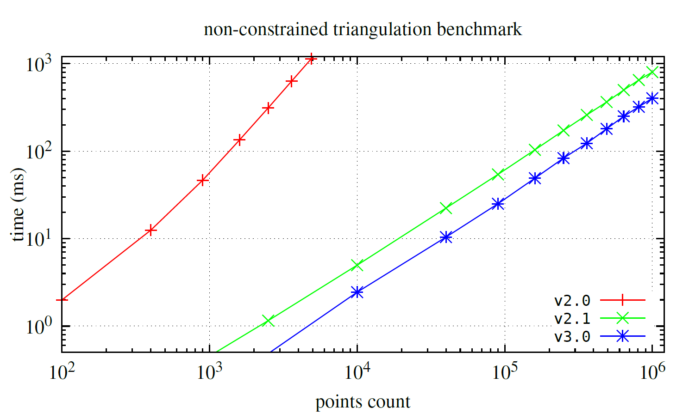
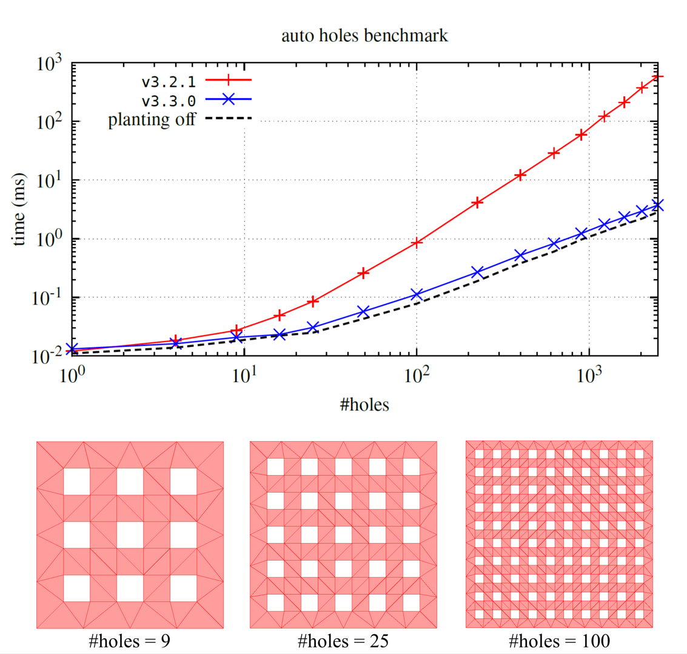
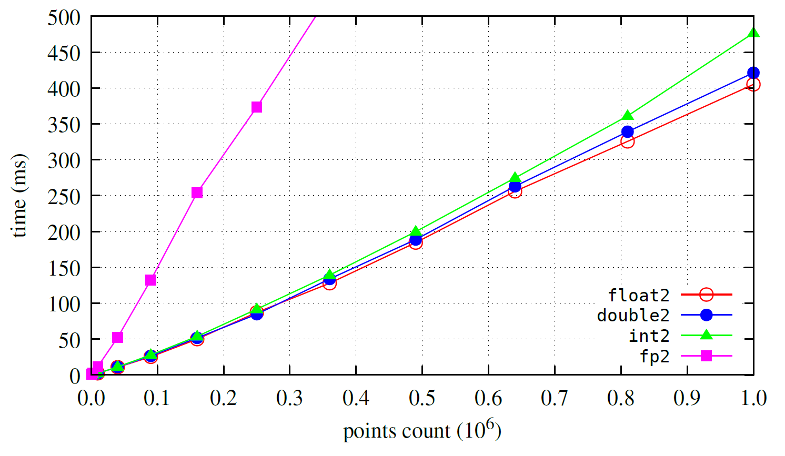

# Benchmark

The package utilizes the [`Burst`][burst] compiler, which generates highly optimized native code using LLVM.

## Other packages

Below, you'll find a performance comparison for *classic* Delaunay triangulation (without refinement or constraints).
between this package and a few alternatives:

- [`delaunator-sharp`][delaunator-sharp]
- [`CGALDotNet`][cgaldotnet]
- [`Triangle.NET`][triangle-net]

## Delaunay triangulation

Below, you'll find a performance comparison (with Burst enabled) between `v2.0`, `v2.1`, and `v3.0` for *classic* Delaunay triangulation (without refinement or constraints).
The presented result is for `T2 = float2`.

## Contrained triangulation

Below, you can find a benchmark for constrained triangulation for `v2.1`, `v2.2`, and `v3.0`. The test specimen consists of a 100×100 grid with additional `#constraints`-points distributed in a circle at the center of the grid. In some cases of `v2.1`, the algorithm gets stuck.
Reference timings for non-constrained triangulation for `v2.2` and `v3.0` are marked with a dashed line.
In the figure below, you can also see example test cases: red represents resulting triangles, and blue represents constrained edges.
The presented result is for `T2 = float2`.

## Delaunay triangulation with mesh refinement

Furthermore, we present a performance comparison (with Burst enabled) between `v1.0..v3.6` for the refinement task.
The presented result is for `T2 = float2`.
This test case executes triangulation for a unit square box.

> [!NOTE]  
> Since `v2.4`, the triangulation refinement algorithm has been updated, resulting in improved mesh quality.

Additionally, below we provide a benchmark for a more general test case than the unit square box.
Specifically, the input in this case corresponds to Lake Superior, as commonly used in examples from the package.

## Auto holes

Below is a benchmark for Constrained Delaunay triangulation with the auto-holes option enabled. As a test case, we use a square containing $n\times n$ hole squares (denoted by #holes). Reference timings for the auto-holes option disabled are marked with a dashed line.

## Generic coordinates

Below, one can see the benchmark for generic coordinates for Delaunay triangulation.
`float2` seems to be slightly faster than `double2`, however, any significant difference is noticeable only for very *large* inputs.

[burst]: https://docs.unity3d.com/Packages/com.unity.burst@1.8
[delaunator-sharp]: https://github.com/nol1fe/delaunator-sharp/
[cgaldotnet]: https://github.com/Scrawk/CGALDotNet
[triangle-net]: https://github.com/wo80/Triangle.NET
