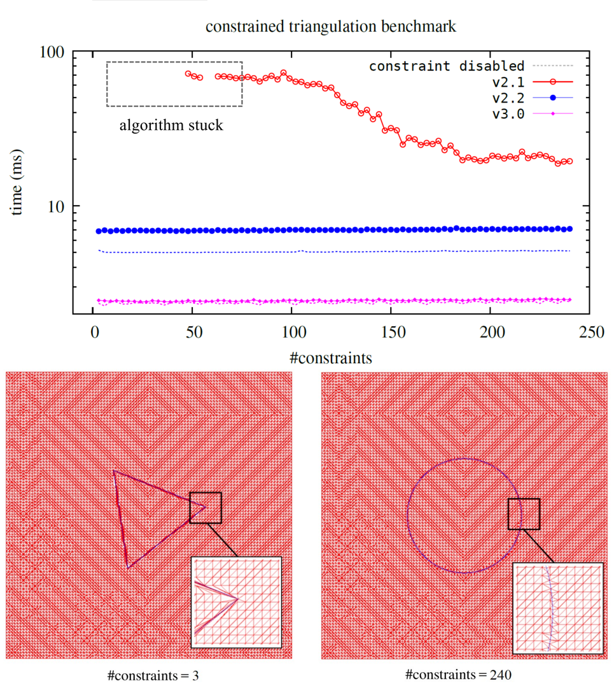
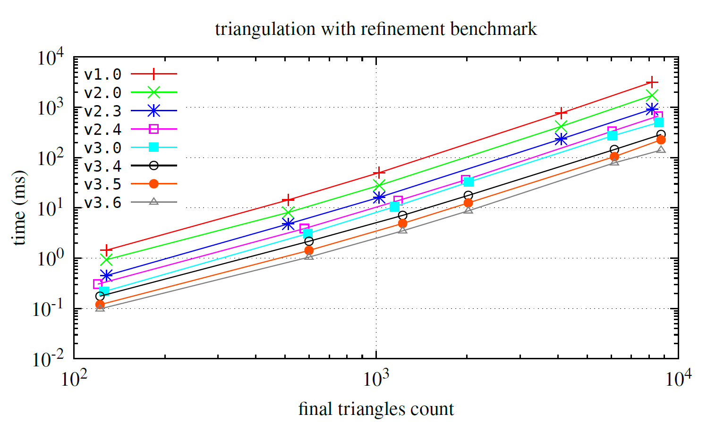

# Benchmark

The package utilizes the [`Burst`][burst] compiler, which generates highly optimized native code using LLVM.

## *Classic* Delaunay triangulation

Below, you'll find a performance comparison (with Burst enabled) between `v2.0.0` and `v2.1.0`, as well as a comparison with [`delaunator-sharp`](https://github.com/nol1fe/delaunator-sharp/) for *classic* Delaunay triangulation (without refinement or constraints).

## Contrained triangulation

Below, you can find a benchmark for constrained triangulation for both `v2.1` and `v2.2`. The test specimen consists of a 100×100 grid with additional `#constraints`-points distributed in a circle at the center of the grid. In some cases of `v2.1`, the algorithm gets stuck. Reference timings for non-constrained triangulation are marked with a gray line.
In the figure below, you can also see example test cases: red represents resulting triangles, and blue represents constrained edges.

## Delaunay triangulation with mesh refinement

Furthermore, we present a performance comparison (with Burst enabled) between `v1.0`, `v2.0`, `v2.3`, and `v2.4` for the refinement task.

> [!NOTE]  
> Since v2.4, the triangulation refinement algorithm has been updated, resulting in improved mesh quality.

[burst]: https://docs.unity3d.com/Packages/com.unity.burst@1.8
