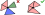

# 𝛼-shape filter <!-- LaTeX not supported in "card title" -->

The package also provides the ability to apply the $\alpha$-shape filter (see [Introduction]) during triangulation, i.e., to remove any triangle whose circumradius $R$ satisfies the condition $R^2 \ge \alpha^{-1}$.
This can be particularly useful when reconstructing meshes from point clouds without introducing additional constraints.

```csharp
using var positions = new NativeArray<double2>(..., Allocator.Persistent);
using var triangulator = new Triangulator(Allocator.Persistent)
{
  Input = { Positions = positions },
  Settings = { UseAlphaShapeFilter = true, AlphaShapeSettings = { Alpha = 0.1f, ... }},
};

triangulator.Run();
```

## Additional settings

### Protect points

By default, the $\alpha$-shape filter can remove any triangle, which may result in some input points not being associated with any triangle.
To prevent this, use the [`ProtectPoints`][protect-points] option:

```csharp
triangulator.Settings.AlphaShapeSettings.ProtectPoints = true;
```

Enabling this option ensures that all input points are assigned to at least one triangle.[^1]

### Protect constraints

By default, the $\alpha$-shape filter may remove triangles even if they include constrained edges.
Use the [`ProtectConstraints`][protect-constraints] setting to ensure that triangles with any constrained edge are not removed:

```csharp
triangulator.Settings.AlphaShapeSettings.ProtectConstraints = true;
```

### Prevent windmills

Using the $\alpha$-shape filter may sometimes produce windmill-like triangle structures.
Such a structure occurs when the triangles connected to a single point can be grouped into more than one connected component (see example below):

By default, using $\alpha$-shape filter can produce *windmill* like triangle structures.
TSuch a structure occurs when for a single point one can group point's triangles into more than one colored group, see example below:

<p align="center"></p>
<br>

This may be undesirable, as it can alter the mesh's topology, coloring, or continuity (see also [Utilities])
To prevent these structures from forming, enable the [`PreventWindmills`][prevent-windmills] setting

```csharp
triangulator.Settings.AlphaShapeSettings.PreventWindmills = true;
```

[^1]: This guarantee only applies to triangles removed by this feature.

[Introduction]: xref:introduction-md#-shape-filter
[Utilities]: xref:utilities-md#generatetrianglecolors

[protect-points]: xref:andywiecko.BurstTriangulator.AlphaShapeSettings.ProtectPoints
[protect-constraints]: xref:andywiecko.BurstTriangulator.AlphaShapeSettings.ProtectConstraints
[prevent-windmills]: xref:andywiecko.BurstTriangulator.AlphaShapeSettings.PreventWindmills
