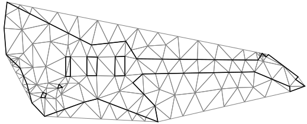

# Constrained triangulation


## `ConstraintEdges` Input

It is not guaranteed that all edges in the input will be present in the *classic* Delaunay triangulation result.
To ensure specific edges $\{(i, j)\}$ are included in the final triangulation, specify the constraints in [`Input.ConstraintEdges`][input-constraint-edges].
Provide additional input data as a continuous index array:

$$
[a_0, a_1, b_0, b_1, c_0, c_1, \dots]
$$

This corresponds to constraint edges $\{ (a_0, a_1), (b_0, b_1), (c_0, c_1), \dots\}$.

```csharp
using var constraintEdges = new NativeArray<int>(..., Allocator.Persistent);
using var positions = new NativeArray<double2>(..., Allocator.Persistent);
using var triangulator = new Triangulator(Allocator.Persistent)
{
  Input = { 
    Positions = positions,
    ConstraintEdges = constraintEdges,
  },
};

triangulator.Run();

var triangles = triangulator.Output.Triangles;
```

After providing the corresponding input for the constraints, the result of the constrained triangulation fully covers all specified edges by the user.

## Constrained triangulation with refinement



Constrained triangulation can also be refined in the same manner as non-constrained triangulation by enabling corresponding options in the triangulation settings:

```csharp
triangulator.Settings.RefineMesh = true;
```

After enabling refinement and the constraints, and providing the input, the result of the constrained triangulation fully covers all specified edges by the user, and the mesh is refined according to the given refinement conditions.

> [!WARNING]  
> Without restoring boundaries, the result of mesh refinement, especially in cases with very acute angles,
> can be of poor quality. Compare this with the result presented in the [holes and boundaries example](xref:example-holes-and-boundaries).

[input-constraint-edges]: xref:andywiecko.BurstTriangulator.InputData`1.ConstraintEdges
