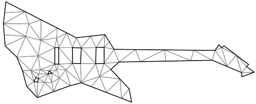

# Holes and boundaries



## Restoring boundaries

The package also provides an option for restoring boundaries. In addition to setting the [`RestoreBoundary`][restore-boundary-property] property, one needs to provide edge constraints to restore the boundaries.

```csharp
using var constraintEdges = new NativeArray<int>(..., Allocator.Persistent);
using var positions = new NativeArray<float2>(..., Allocator.Persistent);
using var triangulator = new Triangulator(Allocator.Persistent)
{
  Input = { 
    Positions = positions,
    ConstraintEdges = constraintEdges,
  },
  Settings = {
    RestoreBoundary = true,
  }
};

triangulator.Run();

var triangles = triangulator.Output.Triangles;
```

## Holes supports

The package also provides an option for creating holes.
In addition to setting the [`Input.ConstraintEdges`][input-constraint-edges], a user needs to provide positions of the holes in the same space as the [`Input.Positions`][input-positions]. Enabling the [`RestoreBoundary`][restore-boundary-property] option is not mandatory; holes could be introduced independently of preserving the boundaries.

```csharp
using var constraintEdges = new NativeArray<int>(..., Allocator.Persistent);
using var holes = new NativeArray<float2>(..., Allocator.Persistent);
using var positions = new NativeArray<float2>(..., Allocator.Persistent);
using var triangulator = new Triangulator(Allocator.Persistent)
{
  Input = { 
    Positions = positions,
    ConstraintEdges = constraintEdges,
    HoleSeeds = holes,
  },
  Settings = {
    RestoreBoundary = true, // optional can be set independently
  }
};

triangulator.Run();

var triangles = triangulator.Output.Triangles;
```

## Auto holes and boundary

The package also provides automatic hole detection and restoring boundary. If one sets [`Settings.AutoHolesAndBoundary`][auto-holes-property] to `true`, then holes will be created automatically depending on the provided constraints.

```csharp
using var positions = new NativeArray<float2>(..., Allocator.Persistent);
using var constraintEdges = new NativeArray<int>(..., Allocator.Persistent);
using var triangulator = new Triangulator(Allocator.Persistent)
{
  Input = { 
    Positions = positions,
    ConstraintEdges = constraintEdges,
  },
  Settings = { AutoHolesAndBoundary = true, },
};

triangulator.Run();

var triangles = triangulator.Output.Triangles;
```

> [!WARNING]  
> The current implementation of [`AutoHolesAndBoundary`][auto-holes-property] detects only *1-level islands*.
> It will not detect holes in *solid* meshes inside other holes.

[restore-boundary-property]: xref:andywiecko.BurstTriangulator.Triangulator.TriangulationSettings.RestoreBoundary
[input-constraint-edges]: xref:andywiecko.BurstTriangulator.Triangulator.InputData.ConstraintEdges
[input-positions]: xref:andywiecko.BurstTriangulator.Triangulator.InputData.Positions
[auto-holes-property]: xref:andywiecko.BurstTriangulator.Triangulator.TriangulationSettings.AutoHolesAndBoundary
