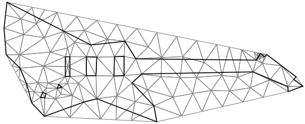
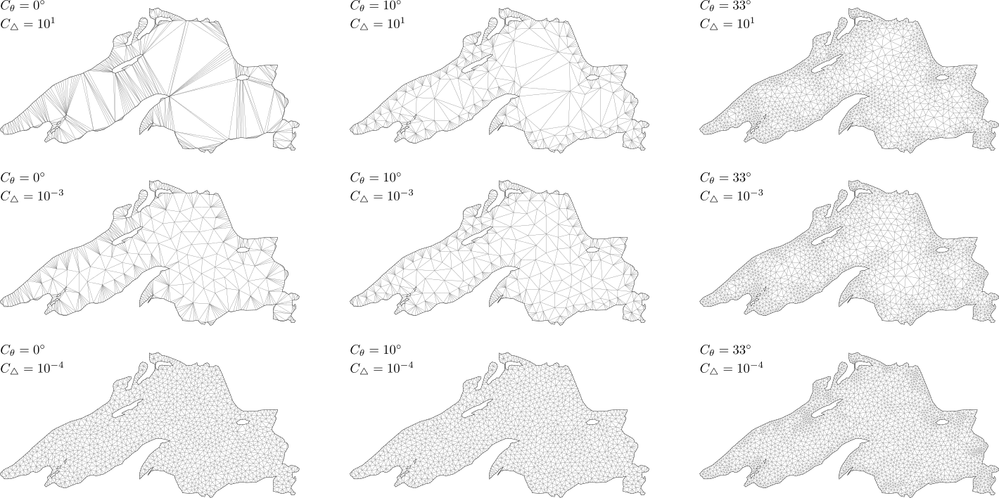

# Triangulation with refinement



To proceed with triangulation using mesh refinement, set [`RefineMesh`][refine-mesh] to true and specify the required [`RefinementThresholds`][thresholds]:

```csharp
using var inputPositions = new NativeArray<double2>(..., Allocator.Persistent);
using var triangulator = new Triangulator(Allocator.Persistent)
{
  Input = { Positions = inputPositions },
  Settings = {
    RefineMesh = true,
    RefinementThresholds = {
      Area = 1f,
      Angle = math.radians(20f)
    },
  }
};

triangulator.Run();

var triangles = triangulator.Output.Triangles;
var positions = triangulator.Output.Positions;
```

The refinement process is controlled by two threshold parameters:

- [`Area`][area]: denoted as $C_\triangle$
- [`Angle`][angle]: denoted as $C_\theta$

These parameters allow fine-tuning of the refinement results based on specific criteria.
Below, you can observe a set of results obtained by applying the refinement process to input data from Lake Superior (open the image in a new tab to see the details).

<br>



<br>

> [!NOTE]
> Refinement is available for both constrained and non-constrained triangulation.

[area]: xref:andywiecko.BurstTriangulator.RefinementThresholds.Area
[angle]: xref:andywiecko.BurstTriangulator.RefinementThresholds.Angle
[refine-mesh]: xref:andywiecko.BurstTriangulator.TriangulationSettings.RefineMesh
[thresholds]: xref:andywiecko.BurstTriangulator.RefinementThresholds
