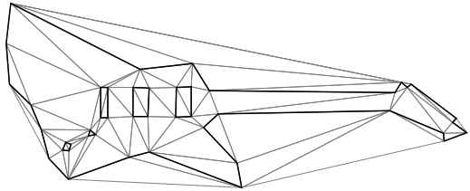

# Delaunay triangulation



To perform a *classic*, i.e., non-constrained without refinement, Delaunay triangulation, use the following:

```csharp
using var positions = new NativeArray<double2>(..., Allocator.Persistent);
using var triangulator = new Triangulator(Allocator.Persistent)
{
  Input = { Positions = positions }
};

triangulator.Run();

var triangles = triangulator.Output.Triangles;
```

> [!TIP]  
> *Classic* triangulation will produce convex hull of the given input.
> To learn how to restore the boundary click [**here**][example-boundaries].

[example-boundaries]: xref:example-holes-and-boundaries
