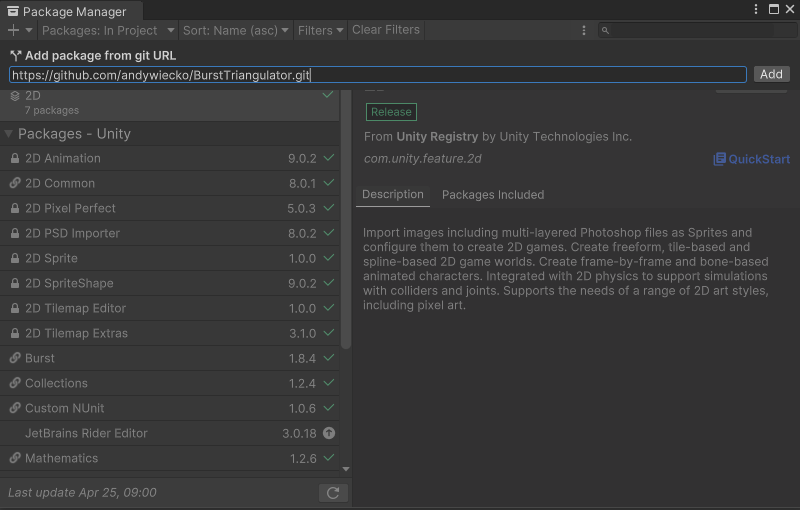
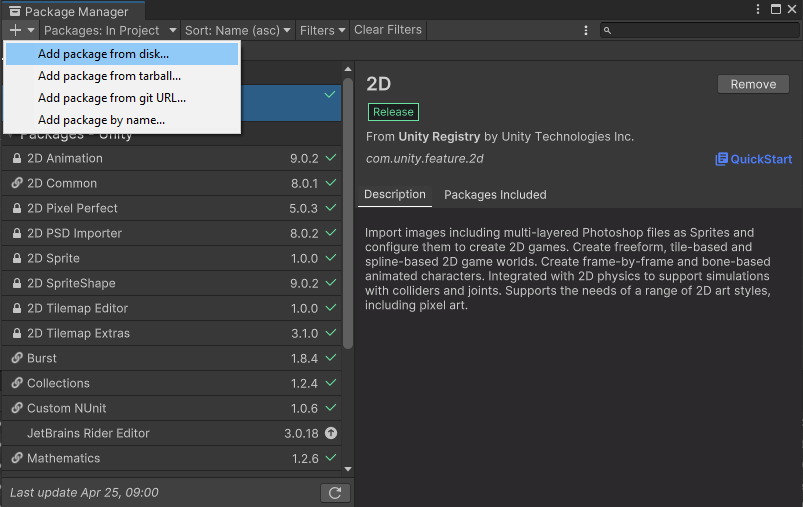

# Getting started

Install the package using one of the following methods. Using OpenUPM is **recommended**.

## [**OpenUPM**](#tab/openupm)

Follow the tutorial at [OpenUPM docs](https://openupm.com/docs/getting-started.html).

Alternatively, you can set up `manifest.json` manually. Add or modify scoped registries in the manifest:

```json
  "scopedRegistries": [
    {
      "name": "OpenUPM",
      "url": "https://package.openupm.com/",
      "scopes": [
        "com.andywiecko"
      ]
    }
  ]
```

Then, in the dependencies section, provide the desired version of the package:

```json
"dependencies": {
    "com.andywiecko.burst.triangulator": "3.8.0",
    ...
```

Refer to the [Unity docs](https://docs.unity3d.com/2021.1/Documentation/Manual/upm-scoped.html) for more details.

## [git](#tab/git)

Use the package manager via git install: `https://github.com/andywiecko/BurstTriangulator.git`



Alternatively, you can edit `manifest.json` manually:

```json
"dependencies": {
    "com.andywiecko.burst.triangulator": "https://github.com/andywiecko/BurstTriangulator.git",
    ...
```

> [!NOTE]
> By default this method will install the latest commit from the `main` branch of the project repo.
> You can specify a tag or commit by providing an additional hash, e.g.
>
> - to install package `v2.4.0` use: `https://github.com/andywiecko/BurstTriangulator.git#v2.4.0`;
> - to install package at commit `f206441912d8b3fda00fe7438db2a1eec4da5a64` use: `https://github.com/andywiecko/BurstTriangulator.git#f206441912d8b3fda00fe7438db2a1eec4da5a64`.

## [Manual](#tab/manual)

Clone or download this repository and then select `package.json` using Package Manager (`Window/Package Manager`).



## [Copy](#tab/copy)

Since the package is single-file only, one can place the file [`Runtime/Triangulator.cs`][runtime] somewhere in the project to use it independently.
Just remember to install the proper package dependencies.

---

## Dependencies

`BurstTriangulator` has the following dependencies:

- [`Unity.Burst@1.8.7`][burst]
- [`Unity.Collections@2.2.0`][collections]

## Optional dependencies

If you need fixed-point arithmetic, there is an optional dependency:

- [`com.danielmansson.mathematics.fixedpoint@0.1.0`][fp-package].

Currently, the package is not available on OpenUPM, so it is recommended to manually install it via `manifest.json` using the following Git URL:

```json
"dependencies": {
   "com.danielmansson.mathematics.fixedpoint": "https://github.com/andywiecko/Unity.Mathematics.FixedPoint.git#d44836cab621f299d6d1bfa275daa437aafc739b",
...
```

[burst]: https://docs.unity3d.com/Packages/com.unity.burst@1.8
[collections]: https://docs.unity3d.com/Packages/com.unity.collections@2.2
[runtime]: https://github.com/andywiecko/BurstTriangulator/blob/main/Runtime/Triangulator.cs
[fp-package]: https://github.com/danielmansson/Unity.Mathematics.FixedPoint
