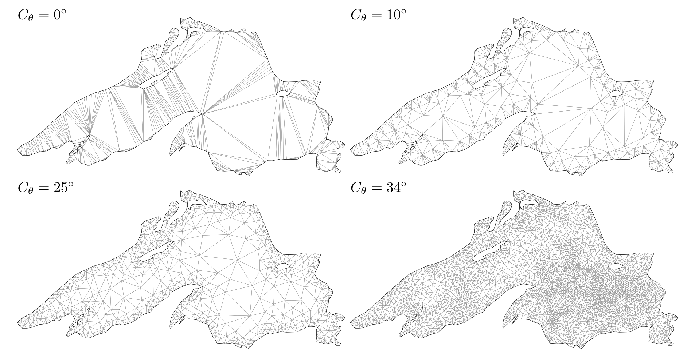

---

A single-file package which provides Delaunay triangulation of the given set of points with constraints and mesh refinement.

To showcase the functionality of our package, we provide an illustrative example featuring the triangulation of Lake Superior using different refinement parameters. The top-left image displays the initial result without any refinement applied.

 

 

---

**Supported Features:**

- [Delaunay triangulation](examples/triangulation.md)
- [Constrained triangulation](examples/constrained-triangulation.md)
- [Mesh refinement](examples/mesh-refinement.md) (angle and area parameters)
- [Holes and restoring boundary](examples/holes-and-boundaries.md) (manual and auto)
- [$\alpha$-shape filter](examples/alpha-shape-filter.md)
- [Support for `Unity.Jobs` pipeline](advanced/input-jobs.md)
- [Input preprocessors](advanced/preprocessor.md)
- [Input validation](advanced/input-validation.md)
- [Generic coordinates](advanced/generic-coordinates.md) (`float2`, `double2`, `Vector2`, `int2`, and fixed-point `Q31.32`)
- [Native support](advanced/unsafe-triangulator.md) (low level API)
- [Managed input support](advanced/input-managed.md)
- [Dynamic triangulation](advanced/dynamic-triangulation.md)
- [Triangle mesh utilities](utilities.md)
