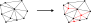
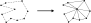
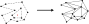
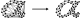

# Introduction

## Delaunay triangulation

Triangulation is a process that converts a set of points into a triangles mesh. This package implements [Delaunay triangulation][delaunay], ensuring that every triangle's circumcircle contains no points from within the mesh. It's important to note that the result will be the convex hull of the input points. Given a set of positions $\{p_i\}$ as input, the output is the triangulation $\mathcal{T}$.

 

 

## Constrained triangulation

In addition to basic triangulation, users may want to enforce certain edges in the final mesh. This can be achieved by providing additional input specifying edge vertices. However, it's worth noting that the resulting triangulation may not maintain the Delaunay property. The input for constrained triangulation includes a set of positions $\{p_i\}$ and constraint edges $\{(i, j)\}$, with the output being the triangulation $\mathcal{T}$.

 

 

## Mesh refinement

In computational simulations, accurately representing long, thin triangles is often challenging. To address this issue, additional points can be strategically inserted into the triangulation to eliminate these problematic elements. Since simulation time is typically proportional to the number of triangles, it's crucial to strike a balance: minimizing the number of triangles while maintaining sufficient detail for accurate results. In this process, denoted as mesh refinement, the input triangulation $\mathcal{T}$ is transformed into $\mathcal{T'}$ by inserting additional points to split edges or triangles.

 

 

## Restore boundary

As previously mentioned, Delaunay triangulation produces the convex hull of points. To support non-convex shapes, edge constraints are introduced, and triangles not included in the boundary of the constraints are removed. Given a set of positions $\{p_i\}$ and constraints $\{(i, j)\}$ as input, the output is the triangulation $\mathcal{T}$, ensuring that the resulting mesh adheres to the specified boundary constraints.

 

 

## Holes

Triangulation can be extended to support meshes with holes by using additional input data, such as hole seeds $\{h_i\}$. However, this process can be automated in some cases, so the holes do not need to be present in the input data.

Hole seeds act as starting points for a removal process resembling the spread of a virus. Starting from the triangle containing $h_i$, neighboring triangles are successively removed until the search reaches the constraint edge. In this process, constraint edges act as barriers, preventing further propagation of the removal.

 

 

## $\alpha$-shape filter

$\alpha$-shape[^edelsbrunner.1983] are closely connected to Delaunay triangulation.
After Delaunay triangulation one can apply filter which removes any triangle for which circumradius $R$ satisfies the condition $R^2 \ge \alpha^{-1}$
This could be used for mesh reconstruction (with holes!) from points cloud without introducing any constraints!

 

 

## Implementation

In this package implemented *classic* Delaunay triangulation is based on
[`delaunator`][delaunator] and [`delaunator-sharp`][delaunator-sharp].
Refinement algorithm is based on [Ruppert's algorithm][rupperts][^ruppert.1995] with [Bowyer–Watson algorithm][bowyerwatson][^bowyer.1981] [^watson.1981] point insertion.
Refinement procedure is inspired by Shewchuk's *terminator* algorithm[^shewchuk.2002].
The package provides also constrained triangulation (with mesh refinement) which is based on Sloan's algorithm[^sloan.1993].
Throughout these algorithms, the package utilizes the *half-edges* data structure.
For further exploration, we recommend referring to the following [article][mapbox].

Currently, the sequence of actions in the implementation follows:

$$
\begin{array}{c}
\boxed{\text{Preprocessor}}\\
\Downarrow\\
\boxed{\text{Delaunay triangulation}}\\
\Downarrow\\
\boxed{\text{Edge constraints}}\\
\Downarrow\\
\boxed{\text{Planting holes}}\\
\Downarrow\\
\boxed{\alpha\text{-shape filter}}\\
\Downarrow\\
\boxed{\text{Refine mesh}}\\
\Downarrow\\
\boxed{\text{Postprocessor}}\\
\end{array}
$$

## Bibliography

[^bowyer.1981]: A. Bowyer. "Computing Dirichlet tessellations". [*Comput. J.* 24 (2): 162–166 (1981)](https://doi.org/10.1093%2Fcomjnl%2F24.2.162).
[^watson.1981]: D. F. Watson. "Computing the n-dimensional Delaunay tessellation with application to Voronoi polytopes". [*Comput. J.* **24**(2): 167–172 (1981)](https://doi.org/10.1093%2Fcomjnl%2F24.2.167).
[^sloan.1993]:S. W. Sloan. "A fast algorithm for generating constrained Delaunay triangulations." [*Comput. Struct.* **47**(3):441-450 (1993)](https://doi.org/10.1016/0045-7949(93)90239-A).
[^ruppert.1995]:J. Ruppert. "A Delaunay Refinement Algorithm for Quality 2-Dimensional Mesh Generation". [*J. Algorithms* **18**(3):548-585 (1995)](https://doi.org/10.1006/jagm.1995.1021).
[^shewchuk.2002]:J. R. Shewchuk. "Delaunay refinement algorithms for triangular mesh generation." [*Comput. Geom.* **22**:1-3 (2002)](https://doi.org/10.1016/S0925-7721(01)00047-5).
[^edelsbrunner.1983]: H. Edelsbrunner, D. Kirkpatrick, R. Seidel. "On the shape of a set of points in the plane." [*IEEE Trans. Inf. Theory*, **29**:4 (1983)](https://doi.org/10.1109/TIT.1983.1056714)

[bowyerwatson]: https://en.wikipedia.org/wiki/Bowyer%E2%80%93Watson_algorithm
[rupperts]: https://en.wikipedia.org/wiki/Delaunay_refinement#Ruppert's_algorithm
[delaunay]: https://en.wikipedia.org/wiki/Delaunay_triangulation
[delaunator]: https://github.com/mapbox/delaunator
[delaunator-sharp]: https://github.com/nol1fe/delaunator-sharp/
[mapbox]: https://mapbox.github.io/delaunator/
