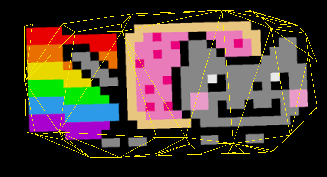
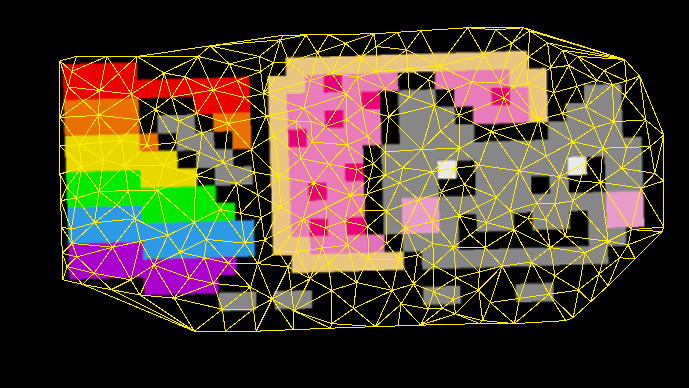
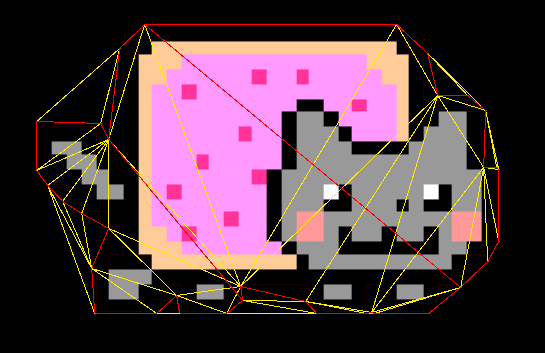
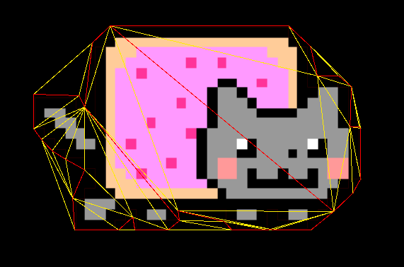
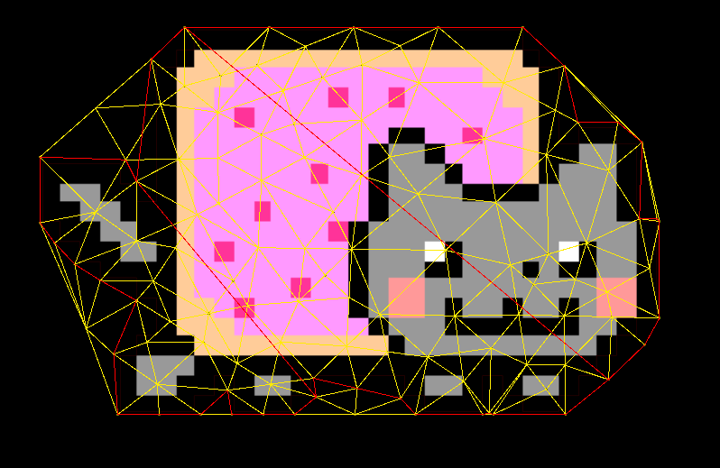
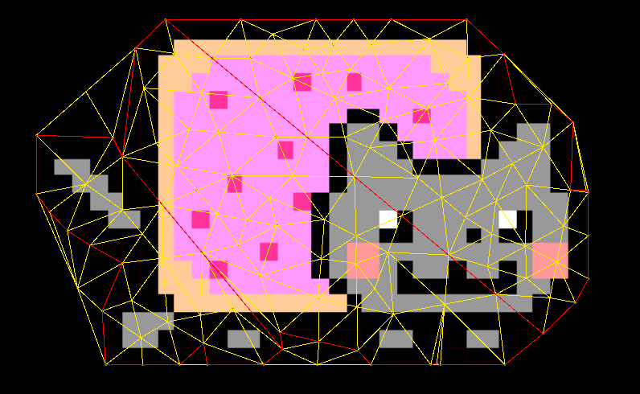
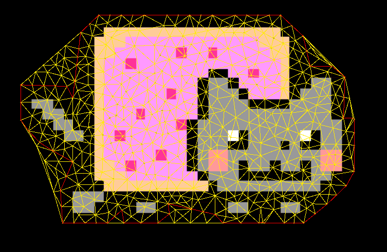
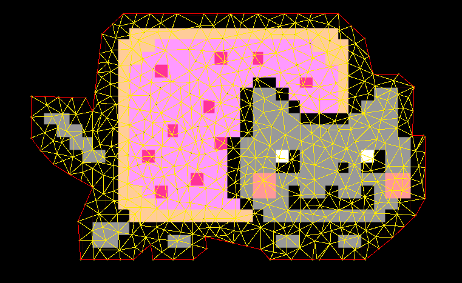
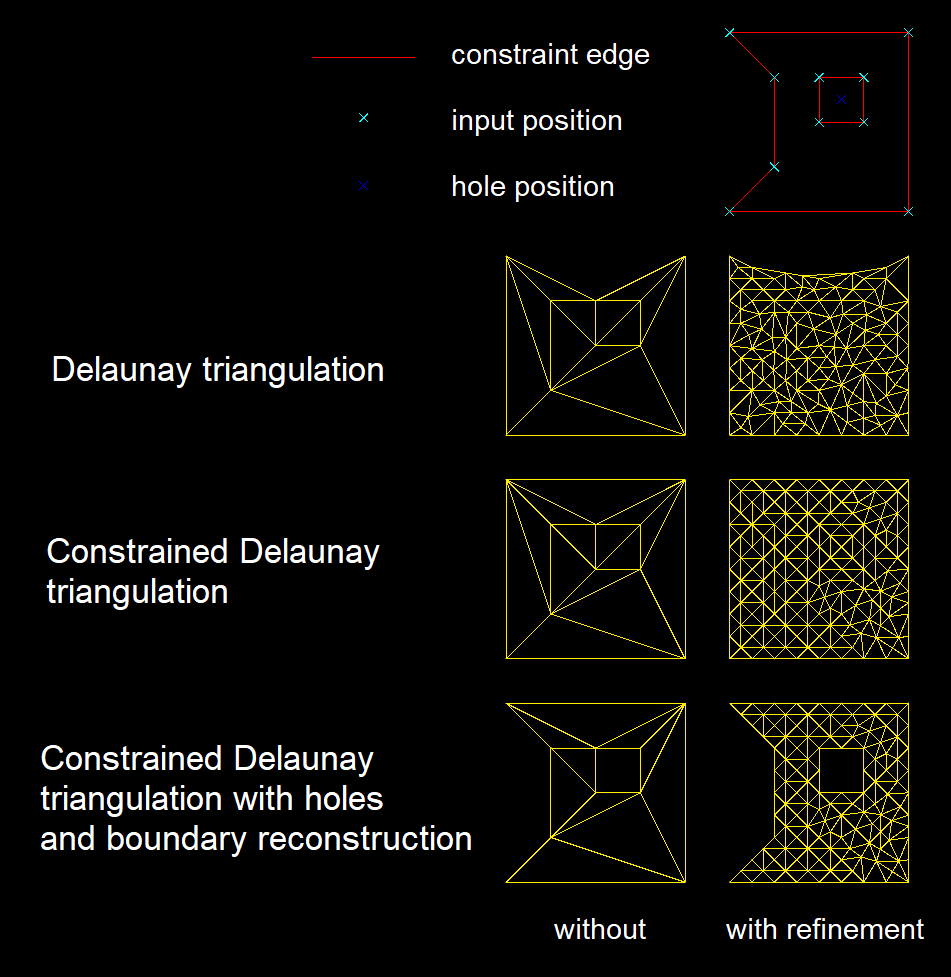
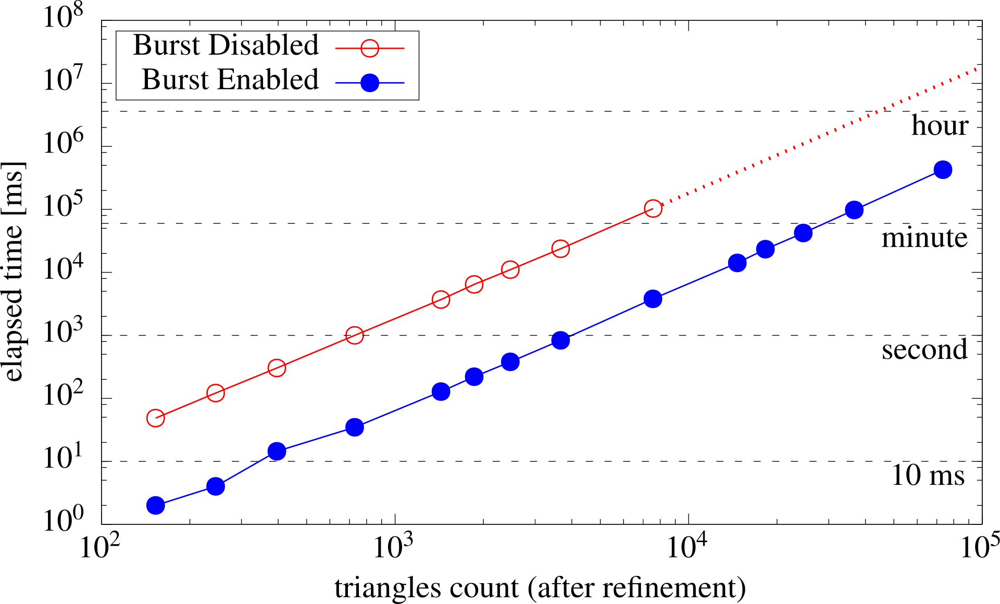

# Burst Triangulator


[](https://github.com/andywiecko/BurstTriangulator/actions/workflows/build.yml)
[](https://github.com/andywiecko/BurstTriangulator/actions/workflows/test.yml)
[](https://openupm.com/packages/com.andywiecko.burst.triangulator/)

A **single-file** package which provides simple Delaunay triangulation of the given set of points (`float2`) with mesh refinement.
Implemented triangulation is based on [Bowyer–Watson algorithm][bowyerwatson][^bowyer.1981] [^watson.1981] and refinement on [Ruppert's algorithm][rupperts][^ruppert.1995].

The package provides also constrained triangulation (with mesh refinement) which is based on Sloan's algorithm[^sloan.1993].

## Table of contents

- [Burst Triangulator](#burst-triangulator)
  - [Table of contents](#table-of-contents)
  - [Getting started](#getting-started)
  - [Example usage](#example-usage)
    - [Delaunay triangulation](#delaunay-triangulation)
    - [Delaunay triangulation with mesh refinement](#delaunay-triangulation-with-mesh-refinement)
    - [Constrained Delaunay triangulation](#constrained-delaunay-triangulation)
    - [Constrained Delaunay triangulation with mesh refinement](#constrained-delaunay-triangulation-with-mesh-refinement)
    - [Support for holes and boundaries](#support-for-holes-and-boundaries)
    - [Summary](#summary)
    - [Input validation](#input-validation)
    - [Generating input in a job](#generating-input-in-a-job)
    - [Reduce the effect of roundoff error](#reduce-the-effect-of-roundoff-error)
      - [PCA transformation](#pca-transformation)
  - [Benchmark](#benchmark)
  - [Dependencies](#dependencies)
  - [Roadmap v2.0](#roadmap-v20)
  - [Bibliography](#bibliography)

## Getting started

Install the package using one of the following methods

<details open>
<summary> Using scoped registry <b>(recommended)</b> </summary>
Use OpenUPM CLI or add corresponding entries to the project's <code>manifest.json</code> manually.
Add or modify scoped registries in the manifest
<pre>
  "scopedRegistries": [
    {
      "name": "OpenUPM",
      "url": "https://package.openupm.com/",
      "scopes": [
        "com.andywiecko"
      ]
    }
  ]
</pre>
and in the dependencies provide selected version of the package
<pre>
"dependencies": {
    "com.andywiecko.burst.triangulator": "1.5.0",
    ...
</pre>
See Unity docs for more details https://docs.unity3d.com/2021.1/Documentation/Manual/upm-scoped.html
</details>

<details>
<summary> <code>git</code> install </summary>
Use package manager via git install: https://github.com/andywiecko/BurstTriangulator.git.
</details>

<details>
<summary> Manual instalation </summary>
Clone or download this repository and then select <code>package.json</code> using Package Manager (<code>Window/Package Manager</code>).
</details>

<details>
<summary> Copy <code>Runtime/Triangulator.cs</code> </summary>
Since the package is single-file only, one can put the file <code>Runtime/Triangulator.cs</code> somewhere in the project to use it independently.
</details>

## Example usage

Below one can find example usage of the `Triangulator` with input set as four
points that form the unit square:

```csharp
using var positions = new NativeArray<float2>(new float2[]
{
  new(0, 0),
  new(1, 0),
  new(1, 1),
  new(0, 1)
}, Allocator.Persistent);

using var triangulator = new Triangulator(capacity: 1024, Allocator.Persistent)
{
  Input = { Positions = positions }
};

triangulator.Run();

var outputTriangles = triangulator.Output.Triangles;
var outputPositions = triangulator.Output.Positions;
```

The result of the triangulation procedure will depend on selected settings.
There are a few settings of the triangulation, shortly described below:

```csharp
using var triangulator = new(1024, Allocator.Persistent)
{
  Settings = 
  {
    // Batch count used in parallel job.
    BatchCount = 64;
    // Triangle is considered as bad if any of its angles is smaller than MinimumAngle. Note: radians.
    MinimumAngle = math.radians(33);
    // Triangle is not considered as bad if its area is smaller than MinimumArea.
    MinimumArea = 0.015f
    // Triangle is considered as bad if its area is greater than MaximumArea.
    MaximumArea = 0.5f;
    // If true refines mesh using Ruppert's algorithm.
    RefineMesh = true;
    // If true constrains edges defined in the Triangulator.Input.ConstraintEdges
    ConstrainEdges = false;
    // If true and provided Triangulator.Input is not valid, it will throw an exception.
    ValidateInput = true;
    // Type of preprocessing algorithm, see the section below for more details.
    Preprocessor = Triangulator.Preprocessor.None;
  }
};
```

Below one can find the result of the triangulation for different selected options.

> **Note**
>
> To obtain the boundary from a texture, the `UnityEngine.PolygonCollider` was used.
> Generating the image boundary is certainly a separate task and is not considered in the project.

### Delaunay triangulation

To use *classic* Delaunay triangulation make sure that constraint and refinement are disabled.

```csharp
settings.RefineMesh = false;
settings.ConstrainEdges = false;
```

The result *without* mesh refinement (Delaunay triangulation):



### Delaunay triangulation with mesh refinement

To proceed with triangulation with the mesh refinement one has to set a proper refinement option

```csharp
settings.RefineMesh = true;
settings.ConstrainEdges = false;
```

Users can control the quality of the triangles by these options

```csharp
// Triangle is considered as bad if any of its angles is smaller than MinimumAngle. Note: radians.
settings.MinimumAngle = math.radians(33);
// Triangle is not considered as bad if its area is smaller than MinimumArea.
settings.MinimumArea = 0.015f
// Triangle is considered as bad if its area is greater than MaximumArea.
settings.MaximumArea = 0.5f;
```

The result *with* mesh refinement:



### Constrained Delaunay triangulation

It is not guaranteed that the boundary of the input will be present in the *classic* Delaunay triangulation result.
One needs to specify the constraints to resolve this issue.
To specify the edges which should be present in the final triangulation
provide the additional input data

```csharp
triangulator.Settings.RefineMesh = false;
triangulator.Settings.ConstrainEdges = true;

// Provided input of constraint edges
// (a0, a1), (b0, b1), (c0, c1), ...
// should be in the following form
// constraintEdges elements:
// [0]: a0, [1]: a1, [2]: b0, [3]: b1, ...
using var constraintEdges = new NativeArray<int>(64, Allocator.Persistent);

triangulator.Input.ConstraintEdges = constraintEdges;
```

In the following figure one can see the non-constrained triangulation result (with yellow), and user-specified constraints (with red).



After enabling `Settings.ConstrainEdges = true` and providing the corresponding input, the result of the constrained triangulation fully covers all specified edges by the user



### Constrained Delaunay triangulation with mesh refinement

Constrained triangulation can be also refined in the same manner as non-constrained one,
by enabling corresponding options in triangulation settings:

```csharp
triangulator.Settings.RefineMesh = true;
triangulator.Settings.ConstrainEdges = true;
```

In the following figure one can see the non-constrained triangulation result (with yellow), and user-specified constraints (with red) with the refinement.



After enabling the refinement and the constraint and providing the input, the result of the constrained triangulation fully covers all specified edges by the user and the mesh is refined with the given refinement conditions.



### Support for holes and boundaries

The package provides also an option for restoring the boundaries.
One has to enable corresponding options and provide the constraints

```csharp
settings.RestoreBoundary = true;
settings.ConstraintEdges = true;
```

In the following figure, one can see the constrained triangulation result (with yellow), and user-specified constraints (with red) with the disabled `RestoreBoundary` and refinement enabled.



After enabling the `RestoreBoundary` the result of the constrained triangulation fully covers all conditions and all invalid triangles are destroyed.



The package provides also an option for creating holes.
Except for setting the `ConstraintEdges`, a user needs to provide positions of the holes in the same space as the `Input.Positions`.
Enabling `RestoringBoundary` option is not mandatory, holes could be introduced independently of preserving the boundaries

```csharp
settings.RestoreBoundary = true; // optional
settings.ConstraintEdges = true;

using var holes = new NativeArray<float2>(new[]{ math.float2(0.5f, 0.5f) }, Allocator.Persistent);
input.HoleSeeds = holes;
```

### Summary

Below one can find the comparison of the results of all possible settings which are available in the package.



### Input validation

If `Triangulator.Settings.ValidateInput` is set to true, the provided data will be validated before running the triangulation procedure.
Input positions, as well as input constraints, have a few restrictions:

- Points count must be greater/equal 3.
- Points positions cannot be duplicated.
- Points cannot contain NaNs or infinities.
- Constraint edges cannot intersect with each other.
- Constraint edges cannot be duplicated or swapped duplicated.
- Zero-length constraint edges are forbidden.
- Constraint edges cannot intersect with points other than the points for which they are defined.

> **Note**
>
> Validation is limited only for Editor!

### Generating input in a job

`BurstTriangulation` input can be generated with job pipeline. One has to use `DeferredJobArrays`, see the example snippet:

```csharp
using var positions = new NativeList<float2>(64, Allocator.Persistent);
using var constraints = new NativeList<int>(64, Allocator.Persistent);
using var holes = new NativeList<float2>(64, Allocator.Persistent);
using var triangulator = new Triangulator(64, Allocator.Persistent)
{
  Input = 
  {
    Positions = positions.AsDeferredJobArray(),
    ConstraintEdges = constraints.AsDeferredJobArray(),
    HoleSeeds = holes.AsDeferredJobArray()
  }
}

var dependencies = new JobHandle();
dependencies = new GenerateInputJob(positions, constraints, holes).Schedule(dependencies); // Lists are fed here.
dependencies = triangulator.Schedule(dependencies);
dependencies.Complete();
```

### Reduce the effect of roundoff error

Triangulation for *non-uniform* data can be demanding, and a few algorithm steps may get stuck if the data is not preprocessed properly.
It is highly recommended that the user should prepare the input data on his own, however, this project provides a few built-in methods.

| Preprocessor | Description        |
|--------------|--------------------|
| None         | Default, no effect. |
| COM          | Transforms input into normalized local space, i.e. [-1, 1] box. |
| [PCA](#pca-transformation) | Transforms input into normalized coordinate systems obtained with *principal component analysis*. |

To use one of the following preprocessors use corresponding settings

```csharp
triangulator.Settings.Preprocessor = Triangulator.Preprocessor.COM;
```

#### PCA transformation

The algorithm usually can help in situations when the Sloan algorithm gets stuck.
The transformation can be applied using the following steps:

1. Calculate com: $\mu = \displaystyle\frac1n\sum_{i=1}^n x_i$.
2. Transform points: $x_i \to x_i -\mu$.
3. Calculate covariance matrix: $\text{cov} = \frac1n\sum_i x_i x_i^{\mathsf T}$.
4. Solve eigenproblem for $\text{cov}$: $\text{cov}u_i =v_i u_i$.
5. Transform points using matrix $U = [u_i]$: $x_i \to U^{\mathsf T} .x_i$.
6. Calculate vector center $c = \frac12[\max(x_i) + \min(x_i)]$ and vector scale $s=2/[\max(x_i) - \min(x_i)]$, where $\min$, $\max$, and "$/$" are component wise operators.
7. Transform points: $x_i \to  s (x_i-c)$, assuming component wise multiplication.

To summarize the transformation is given by:

$$
\boxed{x_i \to s[U^{\mathsf T}(x_i - \mu) - c]}
$$

and inverse transformation

$$
\boxed{x_i \to U(x_i / s + c) + \mu}.
$$

> **Note**
>
> The PCA transformation does not preserve the `Settings.MinimumAngle` used for refinement. 
> As a result, triangles can be classified as bad in the PCA local space.

## Benchmark

The package uses [`Burst`][burst] compiler, which produces highly optimized native code using LLVM.
Below one can see a log-log plot of elapsed time as a function of the final triangles count after mesh refinement.
Using Burst can provide more or less two order of magnitude faster computation.



## Dependencies

- [`Unity.Burst`][burst]
- [`Unity.Collections`][collections]

## Roadmap v2.0

- [ ] Cache circles for constraint edges.
- [ ] Update `edgeToTriangles` buffer instead rebuilding.
- [X] ~~Remove obsoletes.~~
- [ ] Update default `Setting`.
- [X] ~~Bump packages and editor.~~
- [ ] Introduce state to support runtime (build) validation.
- [X] ~~"Extract" transformations.~~

## Bibliography

[^bowyer.1981]: A. Bowyer. "Computing Dirichlet tessellations". [Comput. J. 24 (2): 162–166 (1981)](https://doi.org/10.1093%2Fcomjnl%2F24.2.162).
[^watson.1981]: D.F. Watson. "Computing the n-dimensional Delaunay tessellation with application to Voronoi polytopes". [Comput. J. 24 (2): 167–172 (1981)](https://doi.org/10.1093%2Fcomjnl%2F24.2.167).
[^sloan.1993]:S.W. Sloan. "A fast algorithm for generating constrained Delaunay triangulations." [Comput. Struct. 47.3:441-450 (1993)](https://doi.org/10.1016/0045-7949(93)90239-A).
[^ruppert.1995]:J. Ruppert. "A Delaunay Refinement Algorithm for Quality 2-Dimensional Mesh Generation". [J. Algorithms 18(3):548-585 (1995)](https://doi.org/10.1006/jagm.1995.1021).

[bowyerwatson]: https://en.wikipedia.org/wiki/Bowyer%E2%80%93Watson_algorithm
[rupperts]: https://en.wikipedia.org/wiki/Delaunay_refinement#Ruppert's_algorithm
[burst]: https://docs.unity3d.com/Packages/com.unity.burst@1.8/manual/index.html
[collections]: https://docs.unity3d.com/Packages/com.unity.collections@2.1/manual/index.html
