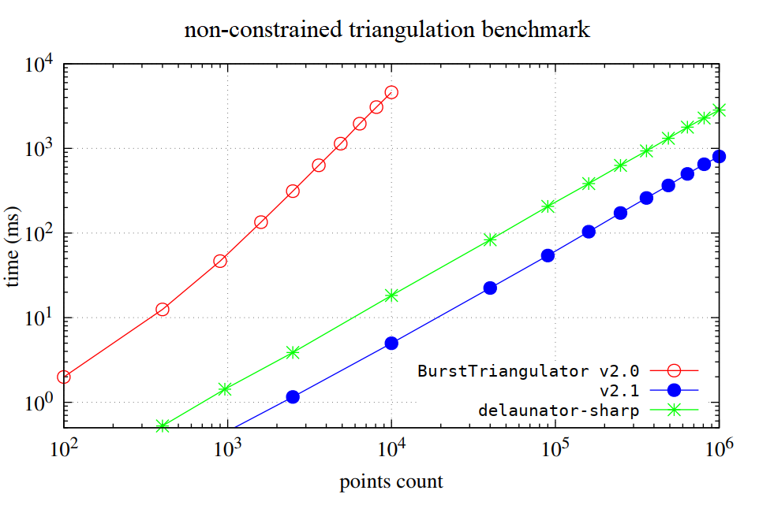
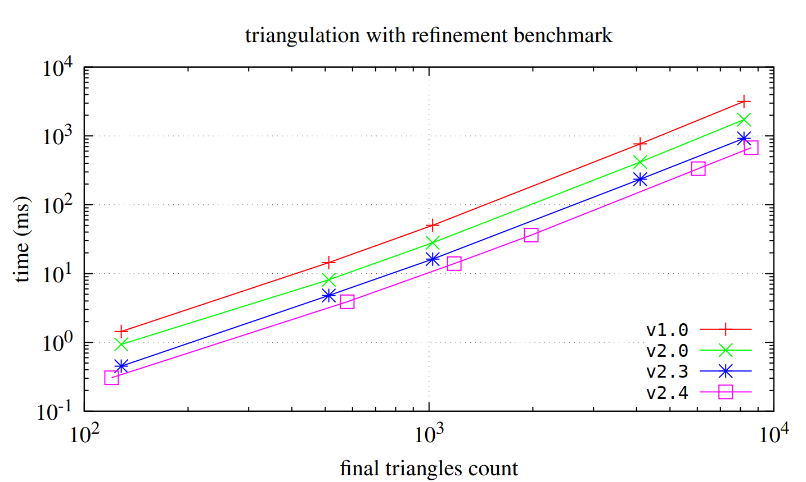

# Burst Triangulator


[](https://github.com/andywiecko/BurstTriangulator/actions/workflows/build.yml)
[](https://github.com/andywiecko/BurstTriangulator/actions/workflows/test.yml)
[](https://openupm.com/packages/com.andywiecko.burst.triangulator/)

A **single-file** package which provides simple Delaunay triangulation of the given set of points (`float2`) with mesh refinement.

Implemented *classic* Delaunay triangulation is based on
[`delaunator`](https://github.com/mapbox/delaunator) and [`delaunator-sharp`](https://github.com/nol1fe/delaunator-sharp/).
Refinement algorithm is based on [Ruppert's algorithm][rupperts][^ruppert.1995] with [Bowyer–Watson algorithm][bowyerwatson][^bowyer.1981] [^watson.1981] point insertion.
Refinement procedure is inspired by Shewchuk's *terminator* algorithm[^shewchuk.2002].
The package provides also constrained triangulation (with mesh refinement) which is based on Sloan's algorithm[^sloan.1993].

As an illustrative example, we present the triangulation of Lake Superior with various refinement parameters. The top-left image shows the result without any refinement.


## Table of contents

- [Burst Triangulator](#burst-triangulator)
  - [Table of contents](#table-of-contents)
  - [Getting started](#getting-started)
  - [Example usage](#example-usage)
    - [Delaunay triangulation](#delaunay-triangulation)
    - [Delaunay triangulation with mesh refinement](#delaunay-triangulation-with-mesh-refinement)
    - [Constrained Delaunay triangulation](#constrained-delaunay-triangulation)
    - [Constrained Delaunay triangulation with mesh refinement](#constrained-delaunay-triangulation-with-mesh-refinement)
    - [Support for holes and boundaries](#support-for-holes-and-boundaries)
    - [Summary](#summary)
    - [Input validation](#input-validation)
    - [Generating input in a job](#generating-input-in-a-job)
    - [Reduce the effect of roundoff error](#reduce-the-effect-of-roundoff-error)
      - [PCA transformation](#pca-transformation)
  - [Benchmark](#benchmark)
  - [Dependencies](#dependencies)
  - [Known Issues](#known-issues)
  - [Roadmap v3.0](#roadmap-v30)
  - [Bibliography](#bibliography)

## Getting started

Install the package using one of the following methods

<details open>
<summary> Using scoped registry <b>(recommended)</b> </summary>
Use OpenUPM CLI or add corresponding entries to the project's <code>manifest.json</code> manually.
Add or modify scoped registries in the manifest
<pre>
  "scopedRegistries": [
    {
      "name": "OpenUPM",
      "url": "https://package.openupm.com/",
      "scopes": [
        "com.andywiecko"
      ]
    }
  ]
</pre>
and in the dependencies provide selected version of the package
<pre>
"dependencies": {
    "com.andywiecko.burst.triangulator": "2.4.0",
    ...
</pre>
See Unity docs for more details https://docs.unity3d.com/2021.1/Documentation/Manual/upm-scoped.html
</details>

<details>
<summary> <code>git</code> install </summary>
Use package manager via git install: https://github.com/andywiecko/BurstTriangulator.git.
</details>

<details>
<summary> Manual instalation </summary>
Clone or download this repository and then select <code>package.json</code> using Package Manager (<code>Window/Package Manager</code>).
</details>

<details>
<summary> Copy <code>Runtime/Triangulator.cs</code> </summary>
Since the package is single-file only, one can put the file <code>Runtime/Triangulator.cs</code> somewhere in the project to use it independently.
</details>

## Example usage

Below one can find example usage of the `Triangulator` with input set as four
points that form the unit square:

```csharp
using var positions = new NativeArray<float2>(new float2[]
{
  new(0, 0),
  new(1, 0),
  new(1, 1),
  new(0, 1),
}, Allocator.Persistent);

using var triangulator = new Triangulator(capacity: 1024, Allocator.Persistent)
{
  Input = { Positions = positions }
};

triangulator.Run();

var outputTriangles = triangulator.Output.Triangles;
var outputPositions = triangulator.Output.Positions;
```

The result of the triangulation procedure will depend on selected settings.
There are a few settings of the triangulation, shortly described below:

```csharp
using var triangulator = new Triangulator(1024, Allocator.Persistent)
{
  Settings = 
  {
    RefinementThresholds = {
      // Specifies the maximum area constraint for triangles in the resulting mesh refinement.
      // Ensures that no triangle in the mesh has an area larger than the specified value.
      Area = 1f,
      // Specifies the refinement angle constraint for triangles in the resulting mesh.
      // Ensures that no triangle in the mesh has an angle smaller than the specified value.
      Angle = math.radians(20),
    },
    // Batch count used in parallel job.
    BatchCount = 64,
    // If true refines mesh using Ruppert's algorithm.
    RefineMesh = true,
    // If true constrains edges defined in the Triangulator.Input.ConstraintEdges
    ConstrainEdges = false,
    // If true the mesh boundary is restored using Input constraint edges.
    RestoreBoundary = false,
    // If true and provided Triangulator.Input is not valid, it will throw an exception.
    // The error can be catch by using the `Triangulator.Output.Status`.
    ValidateInput = true,
    // Type of preprocessing algorithm, see the section below for more details.
    Preprocessor = Triangulator.Preprocessor.None,
  }
};
```

If the triangulation algorithm fails, checking the status and handling it in the job pipeline can be considered.
For example:

```csharp
[BurstCompile]
private struct Job : IJob
{
  NativeReference<Triangulator.Status>.ReadOnly status;

  public Job(Triangulator triangulator)
  {
    status = triangulator.Output.Status.AsReadOnly();
  }

  public void Execute()
  {
    if(status != Triangulator.Status.OK)
    {
      return;
    }

    ...
  }
}

...

var dependencies = default(JobHandle);
dependencies = triangulator.Schedule(dependencies);
dependencies = new Job(triangulator).Schedule(dependencies);

...
```

Below, you can find the results of the triangulation for different selected options. 
The _cool_ guitar was used as an input test case.


### Delaunay triangulation

To use *classic*, i.e. non-constrained without refinement, Delaunay triangulation one can use the following

```csharp
using var positions = new NativeArray<float2>(..., Allocator.Persistent);
using var triangulator = new Triangulator(Allocator.Persistent)
{
  Input = { Positions = positions }
};

triangulator.Schedule().Complete();

var triangles = triangulator.Output.Triangles;
```

The result *without* mesh refinement (Delaunay triangulation):


### Delaunay triangulation with mesh refinement

To proceed with triangulation with the mesh refinement one has to set a proper refinement option

```csharp
using var positions = new NativeArray<float2>(..., Allocator.Persistent);
using var triangulator = new Triangulator(Allocator.Persistent)
{
  Input = { Positions = positions },
  Settings = {
    RefineMesh = true,
    RefinementThresholds = {
      Area = 1f,
      Angle = math.radians(20f)
    },
  }
};

triangulator.Schedule().Complete();

var triangles = triangulator.Output.Triangles;
```

The result *with* mesh refinement:


The refinement process is controlled by two threshold parameters:

- `Area`: denoted as $C_\triangle$
- `Angle`: denoted as $C_\theta$

These parameters allow fine-tuning of the refinement results based on specific criteria.
Below, you can observe a set of results obtained by applying the refinement process to input data from Lake Superior (open image in a new tab to see the details).


### Constrained Delaunay triangulation

It is not guaranteed that the boundary of the input will be present in the *classic* Delaunay triangulation result.
One needs to specify the constraints to resolve this issue.
To specify the edges which should be present in the final triangulation
provide the additional input data

```csharp
// Provided input of constraint edges
// (a0, a1), (b0, b1), (c0, c1), ...
// should be in the following form
// constraintEdges elements:
// [0]: a0, [1]: a1, [2]: b0, [3]: b1, ...
using var constraintEdges = new NativeArray<int>(64, Allocator.Persistent);
using var positions = new NativeArray<float2>(..., Allocator.Persistent);
using var triangulator = new Triangulator(Allocator.Persistent)
{
  Input = { 
    Positions = positions,
    ConstraintEdges = constraintEdges,
  },
  Settings = {
    ConstrainEdges = true,
  }
};

triangulator.Schedule().Complete();

var triangles = triangulator.Output.Triangles;
```

After enabling `Settings.ConstrainEdges = true` and providing the corresponding input, the result of the constrained triangulation fully covers all specified edges by the user


### Constrained Delaunay triangulation with mesh refinement

Constrained triangulation can be also refined in the same manner as non-constrained one,
by enabling corresponding options in triangulation settings:

```csharp
triangulator.Settings.RefineMesh = true;
triangulator.Settings.ConstrainEdges = true;
```

After enabling the refinement and the constraint and providing the input, the result of the constrained triangulation fully covers all specified edges by the user and the mesh is refined with the given refinement conditions.


### Support for holes and boundaries

The package provides also an option for restoring the boundaries.
One has to enable corresponding options and provide the constraints

```csharp
settings.RestoreBoundary = true;
settings.ConstraintEdges = true;
```

The package provides also an option for creating holes.
Except for setting the `ConstraintEdges`, a user needs to provide positions of the holes in the same space as the `Input.Positions`.
Enabling `RestoringBoundary` option is not mandatory, holes could be introduced independently of preserving the boundaries

```csharp
settings.RestoreBoundary = true; // optional
settings.ConstraintEdges = true;

using var holes = new NativeArray<float2>(new[]{ math.float2(0.5f, 0.5f) }, Allocator.Persistent);
input.HoleSeeds = holes;
```


### Summary

Below one can find the comparison of the results of all possible settings which are available in the package.


### Input validation

If `Triangulator.Settings.ValidateInput` is set to true, the provided data will be validated before running the triangulation procedure.
Input positions, as well as input constraints, have a few restrictions:

- Points count must be greater/equal 3.
- Points positions cannot be duplicated.
- Points cannot contain NaNs or infinities.
- Constraint edges cannot intersect with each other.
- Constraint edges cannot be duplicated or swapped duplicated.
- Zero-length constraint edges are forbidden.
- Constraint edges cannot intersect with points other than the points for which they are defined.

If one of the conditions fails, then triangulation will not be calculated.
One could catch this as an error by using `triangulator.Output.Status` (native, can be used in jobs).

```csharp
using var triangulator = new Triangulator(Allocator.Persistent)
{
  Input = { ... },
  Settings = {
    ValidateInput = true
  },
};

triangulator.Run();

var status = triangulator.Output.Status.Value;
```

### Generating input in a job

`BurstTriangulation` input can be generated with job pipeline. One has to use `DeferredJobArrays`, see the example snippet:

```csharp
using var positions = new NativeList<float2>(64, Allocator.Persistent);
using var constraints = new NativeList<int>(64, Allocator.Persistent);
using var holes = new NativeList<float2>(64, Allocator.Persistent);
using var triangulator = new Triangulator(64, Allocator.Persistent)
{
  Input = 
  {
    Positions = positions.AsDeferredJobArray(),
    ConstraintEdges = constraints.AsDeferredJobArray(),
    HoleSeeds = holes.AsDeferredJobArray()
  }
}

var dependencies = new JobHandle();
dependencies = new GenerateInputJob(positions, constraints, holes).Schedule(dependencies); // Lists are fed here.
dependencies = triangulator.Schedule(dependencies);
dependencies.Complete();
```

### Reduce the effect of roundoff error

Triangulation for *non-uniform* data can be demanding, and a few algorithm steps may get stuck if the data is not preprocessed properly.
It is highly recommended that the user should prepare the input data on his own, however, this project provides a few built-in methods.

| Preprocessor | Description        |
|--------------|--------------------|
| None         | Default, no effect. |
| COM          | Transforms input into normalized local space, i.e. [-1, 1] box. |
| [PCA](#pca-transformation) | Transforms input into normalized coordinate systems obtained with *principal component analysis*. |

To use one of the following preprocessors use corresponding settings

```csharp
triangulator.Settings.Preprocessor = Triangulator.Preprocessor.COM;
```

#### PCA transformation

The algorithm usually can help in situations when the Sloan algorithm gets stuck.
The transformation can be applied using the following steps:

1. Calculate com: $\mu = \displaystyle\frac1n\sum_{i=1}^n x_i$.
2. Transform points: $x_i \to x_i -\mu$.
3. Calculate covariance matrix: $\text{cov} = \frac1n\sum_i x_i x_i^{\mathsf T}$.
4. Solve eigenproblem for $\text{cov}$: $\text{cov}u_i =v_i u_i$.
5. Transform points using matrix $U = [u_i]$: $x_i \to U^{\mathsf T} .x_i$.
6. Calculate vector center $c = \frac12[\max(x_i) + \min(x_i)]$ and vector scale $s=2/[\max(x_i) - \min(x_i)]$, where $\min$, $\max$, and "$/$" are component wise operators.
7. Transform points: $x_i \to  s (x_i-c)$, assuming component wise multiplication.

To summarize the transformation is given by:

$$
\boxed{x_i \to s[U^{\mathsf T}(x_i - \mu) - c]}
$$

and inverse transformation

$$
\boxed{x_i \to U(x_i / s + c) + \mu}.
$$

> **Note**
>
> The PCA transformation does not preserve the `Settings.MinimumAngle` used for refinement. 
> As a result, triangles can be classified as bad in the PCA local space.

## Benchmark

The package utilizes the [`Burst`][burst] compiler, which generates highly optimized native code using LLVM.

Below, you'll find a performance comparison (with Burst enabled) between `v2.0.0` and `v2.1.0`, as well as a comparison with [`delaunator-sharp`](https://github.com/nol1fe/delaunator-sharp/) for *classic* Delaunay triangulation (without refinement or constraints).



Below, you can find a benchmark for constrained triangulation for both `v2.1` and `v2.2`. The test specimen consists of a 100×100 grid with additional `#constraints`-points distributed in a circle at the center of the grid. In some cases of `v2.1`, the algorithm gets stuck. Reference timings for non-constrained triangulation are marked with a gray line.
In the figure below, you can also see example test cases: red represents resulting triangles, and blue represents constrained edges.


Furthermore, we present a performance comparison (with Burst enabled) between `v1.0`, `v2.0`, `v2.3`, and `v2.4` for the refinement task.



> **Note**  
> Since v2.4, the triangulation refinement algorithm has been updated, resulting in improved mesh quality.

## Dependencies

- [`Unity.Burst`][burst]
- [`Unity.Collections`][collections]

## Known Issues

- (#103) In the Unity Editor, you may encounter the following log message:

```plaintext
Leak Detected : Persistent allocates 257 individual allocations. To find out more please enable 'Jobs/LeakDetection/Full StackTraces' and reproduce the leak again.
```

Not to worry, this issue is likely related to an internal bug in the `Unity.Collections` or `Unity.Burst` package (related to `NativeQueue<>` allocation).

## Roadmap v3.0

- [X] ~~Adapt Delaunay triangluation to `halfedges` approach.~~
- [X] ~~Adapt constrained triangulation to `halfedges` approach.~~
- [X] ~~Improve performance of the constraint algorithm.~~
- [X] ~~Adapt refinement algorithm to `halfedges` approach.~~
- [X] ~~Remove super-triangle approach.~~
- [X] ~~Improve quality of the refinement algorithm.~~
- [X] ~~Improve performance of the refinement algorithm.~~
- [ ] Clean-up refine job after recent changes.
- [ ] Adapt constraint and *planting* jobs for `constrainedHalfedges`.
- [ ] Simplify generics for *planting* job.
- [ ] Mark `ConstrainEdges` as obsolete.
- [ ] Implement `SplitPermitted` for *terminator*.
- [ ] (?) Partially restore Delaunay property after Sloan's algorithm.
- [ ] (?) Add mesh coarsening algorithm.
- [ ] (?) *Auto holes* detection algorithm.

## Bibliography

[^bowyer.1981]: A. Bowyer. "Computing Dirichlet tessellations". [*Comput. J.* 24 (2): 162–166 (1981)](https://doi.org/10.1093%2Fcomjnl%2F24.2.162).
[^watson.1981]: D. F. Watson. "Computing the n-dimensional Delaunay tessellation with application to Voronoi polytopes". [*Comput. J.* 24 (2): 167–172 (1981)](https://doi.org/10.1093%2Fcomjnl%2F24.2.167).
[^sloan.1993]:S. W. Sloan. "A fast algorithm for generating constrained Delaunay triangulations." [*Comput. Struct.* 47.3:441-450 (1993)](https://doi.org/10.1016/0045-7949(93)90239-A).
[^ruppert.1995]:J. Ruppert. "A Delaunay Refinement Algorithm for Quality 2-Dimensional Mesh Generation". [*J. Algorithms* 18(3):548-585 (1995)](https://doi.org/10.1006/jagm.1995.1021).
[^shewchuk.2002]:J. R. Shewchuk. "Delaunay refinement algorithms for triangular mesh generation." [*Comput. Geom.* 22.1-3 (2002)](https://doi.org/10.1016/S0925-7721(01)00047-5).

[bowyerwatson]: https://en.wikipedia.org/wiki/Bowyer%E2%80%93Watson_algorithm
[rupperts]: https://en.wikipedia.org/wiki/Delaunay_refinement#Ruppert's_algorithm
[burst]: https://docs.unity3d.com/Packages/com.unity.burst@1.8
[collections]: https://docs.unity3d.com/Packages/com.unity.collections@2.2